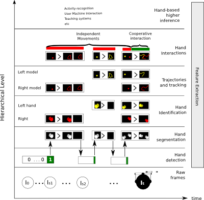

Hand Based Methods
==================

To design a unifying system for hand-based methods in FPV it is important to identify some of the more important components, standardize its inputs/outputs and define their role in the overall system. Our approach stands over the task division proposed in :cite:`Betancourt2014a,Betancourt2014` and is summarized in the hierarchical structure proposed in the Figure below. The figure shows the most important steps in hand-based methods. Some of them could be non necessary for some applications (e.g. not every application needs to identify the left and right hand) or extra levels could be included (e.g. pose recognition). In the bottom part of the diagram are the raw frames, while in the upper part lie the higher inference methods that search for patterns in the hand movements and trajectories. The diagram shows a feature extractor that can be re-used by all the levels: a system that is able to use the same features in multiple levels can save valuable computational resources and processing time.

Hand detection
--------------

This level answers the yes-or-no question of the hands' presence in the frame. This problem is addressed in :cite:`Betancourt2014a` as frame by frame classification problem. In their experiments the authors report that the best result is achieved if Histogram of Oriented Gradients (HOG) is combined with Support Vector Machines (SVM). The following video shows an example of a hand-detector implemented in EgoHands.

.. youtube:: http://www.youtube.com/watch?v=dl4xrvUwI_M

One of the main problems of this frame-by-frame approach is its sensibility to small changes between frames, which makes unstable in time the decisions taken by the classifier. In recent experiments this issue is alleviated using a Probabilistic Graphical Model that filters a real valued representation of the SVM classifier. In the Unified Framework of the hand-detector must be optimized only to detect as fast as possible the frames on which the hands start to show up in the scene

.. toctree::
   :maxdepth: 3
    
   Detecting the hands <handDetection>

Hand segmentation
-----------------

It is probably the more explored problem in FPV. The main task is to delineate the silhouette of the hands at a pixel level. The more promising results are reported in :cite:`Li2013a,Li2013b,Morerio2013` achieving F-scores around $83\%$ under different illumination levels. The following video shows a multi-model pixel by pixel segmentation with 20 illuination models and 10 active models. The frames of this video were not using in the training phase. This example is deeply explained in [:ref:`visualizingSegmentation`]

.. youtube:: https://www.youtube.com/watch?v=jmkayWZA5A0

The main challenge in the pixel-by-pixel approach is the computational complexity of the task, involving the decision for each pixel in each frame.  For instance, the camera of the Google glasses has a resolution of 720p and records 30 frames per second, implying 928.800 pixel classifications per frame and a total of 27'864.000 per second of video. A promising strategy to reduce this number is to simplify the frames as SLIC superpixels \cite{Achanta2012a} and classify the simplified image as is done in :cite:`Serra2013`. 

.. toctree::
   :maxdepth: 3

   Segmenting the hands <handSegmentation>

Hand identification
-------------------

It is an intuitive but challenging task on which the objective is to identify the left and the right hand. The hand-identification problem is extended in \cite{Lee2014}, proposing a Bayesian method to identify, using the relative positions, the hands of the user as well as the hands of a third person in the video. At this point it is worth to mention the robustness of the proposed hand-detector to the presence of third person hands, however, in the segmentation level extra effort must be done to segment only the user hands. Assuming a reliable hand-segmentation it is possible to build a simple identification system based on the angle and the side of the frame from which the hand appears. We found that in realistic scenarios this approach properly differentiate the left and the right hand in almost all the frames at low computational cost. Two difficult scenarios of this approach are: i) When the hands are close enough to create as a single shape, ii) when the appearance of the hands is divided by an external object as a bracelet or a watch, creating several hand-like shapes. Figure \ref{fig:identification} shows an example of our identification algorithm based on manually segmented shapes.

.. youtube:: https://www.youtube.com/watch?v=1_jw2Z9lBtc

.. toctree::
   :maxdepth: 3

   Segmenting the hands <handIdentification>

Hand tracking [In progress]
---------------------------

For a wearable camera it is clearly important to be able to record, track and denoise the hands trajectories. An intuitive and straightforward approach is to keep history of the hands centroid as done in \cite{Morerio2013}, however, the use of dynamic filters could help to increase the accuracy of the trajectories, reduce the sampling rate (the lower the sampling rate the closer to real time performance), and manage the switching process between the hand-detection and the hand-segmentation level. Regarding the initial conditions (e.g. initial coordinates of the tracked hand) the best choice is to use dynamic filters like the h-filter, which only requires the empirical distribution of the initial coordinates \cite{Bhuvana2014}. The initial distribution can be found using empirical data as shown in \cite{Philipose2009}, see Figure \ref{fig:empiricalLocation}. Regarding the dynamic model, our preliminary experiments suggest that a simple linear model could achieve promising results for high frequency sampling, however additional tests are required before a conclusion can be made. Figure \ref{fig:tracking} shows a frame by frame tracking of the hand center.

.. youtube:: https://www.youtube.com/watch?v=wRMVDQaR7XA
