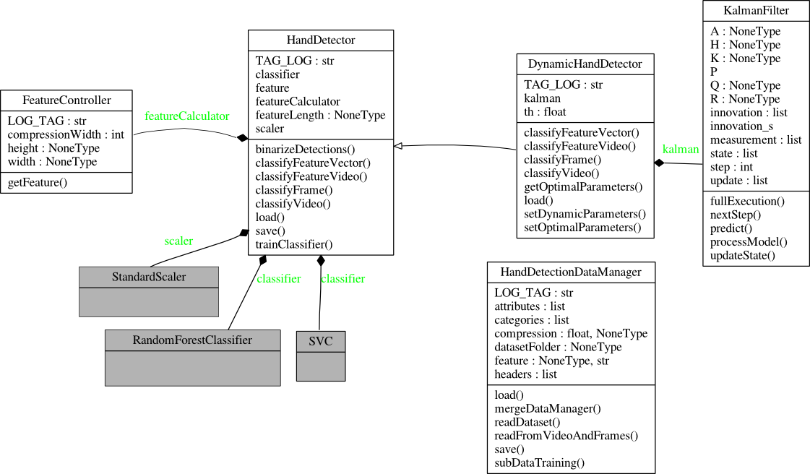

Hand Detection
==============

The following UML diagram summarizes the object structure of the hand-detection module. The main objects in this module are the HandDetection (see :class:`egovision.handDetection.HandDetector`) and its inherited class the DynamicHandDetector(see :class:`egovision.handDetection.DynamicHandDetector`) , which correspond to the methods proposed in :cite:`Betancourt2014a` and :cite:`Betancourt2015a` respectively. There are other three important objects in the diagram: i) The HandDetectorDataManager (see :class:`egovision.handDetection.HandDetectionDataManager`) which reads dataset from a well structured folder, i) The FeatureController which is the controller of the Feature Extraction MCV system :ref:`featureExtraction` iii) The KalmanFilter to provide the dynamic properties of the DynamicHandDetector. In the last part of this section, we provide some extra functionalities to :ref:`visualHandDetector` and to :ref:`confusionDetector`.

 

1. Reading the dataset
----------------------

.. autoclass:: egovision.handDetection.HandDetectionDataManager
   :members:

2. Training the detector
------------------------

Frame by Frame detector
~~~~~~~~~~~~~~~~~~~~~~~
.. autoclass:: egovision.handDetection.HandDetector
   :members:

Dynamic detector
~~~~~~~~~~~~~~~~
.. autoclass:: egovision.handDetection.DynamicHandDetector
   :members:
   :inherited-members:

3. Performance Evaluation
-------------------------

.. _visualHandDetector:

Visualize the detector
~~~~~~~~~~~~~~~~~~~~~~~~
Egovision is able to export your binary classifications as a video. This are some examples of the exported videos and the performance of the frame-by-frame hand-detectors and the dynamic-detectors.

* Example 1: This video shows an outstanding performance in the office. The performance of the method is improved because there are not missleading shapes in the scene.

.. youtube:: kLjH8bHQleE
 

* Example 2: This video shows the same method in a coffe bar. The difference in both performances (office and coffebar) is explained by the shapes of the used tables.

.. youtube:: http://www.youtube.com/watch?v=dl4xrvUwI_M

.. autoclass:: egovision.output.BinaryDecisionManager

.. _confusionDetector:

Evaluate the Hand-Detector
~~~~~~~~~~~~~~~~~~~~~~~~~~
The confusion matrix is a good way to evaluate the performance of the hand detector. In order to build the confusion matrix the ground truth mus be available. In egovision the ground truth is a csv file on wich each line contains the ground truth of a frame. 

.. automethod:: egovision.performance.readGroundTruth

.. automethod:: egovision.performance.getConfusionMatrix
