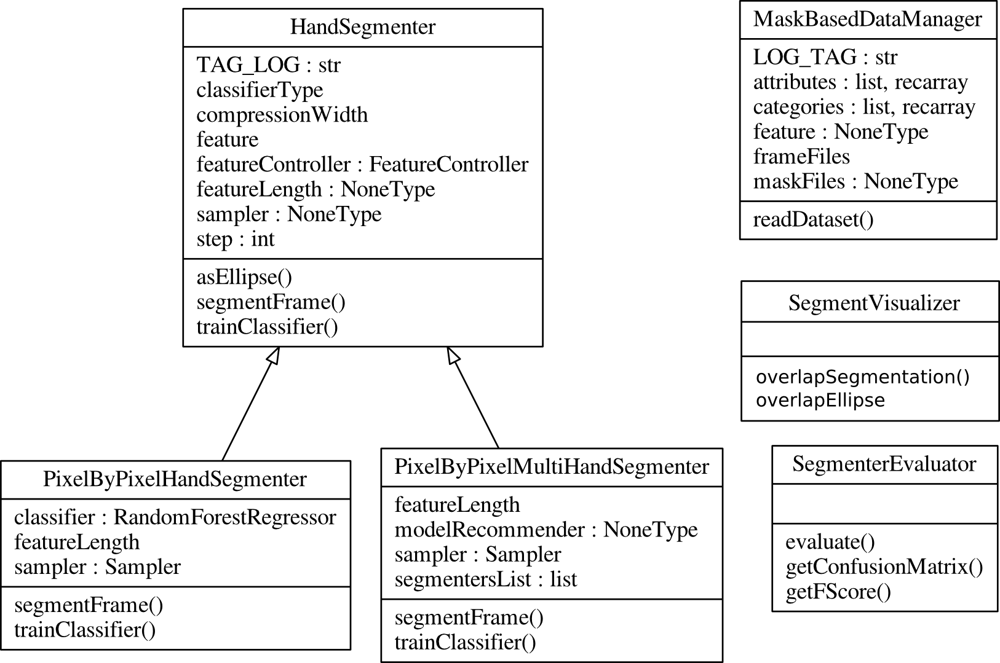

Hand Segmentation
=================

The segmentation module is based on the abstract class Hand-Segmenter. In general, a hand segmenter is an object that is trained by using as input a color images, and as output a binary masks. There are two type of methods in the HandSegmenter model: i) The basic funcionalities to be reused by inherited objects (e.g. Post-Processiag, load, save); ii) The abstract methods that must be specified by each particular hand-segmenter algorithm (e.g. trainClassifier and predictFrame). In the following part we provide some examples of the segmenters currently implemented. Finally, an extra object (MaskBasedDataManager) is used to easily import and train the PixelByPixelHandSegmenters.

1. Reading the dataset
----------------------

.. autoclass:: egovision.handSegmentation.MaskBasedDataManager
   :members:

2. Segmenting the hands
-----------------------

.. automodule:: egovision.handSegmentation.handSegmenter
   :members:

2.1 A Single Model Hand Segmenter
~~~~~~~~~~~~~~~~~~~~~~~~~~~~~~~~~

.. automodule:: egovision.handSegmentation.pixelByPixelHandSegmenter

2.2 A Multi Model Approach
~~~~~~~~~~~~~~~~~~~~~~~~~~

.. automodule:: egovision.handSegmentation.pixelByPixelMultiHandSegmenter

3. Post-Process
---------------
.. automodule:: egovision.handSegmentation.postProcessor.postProcessor

.. autoclass:: egovision.handSegmentation.PostB2016 
   

4. Performance Evaluation
-------------------------

.. _visualHandDetector:

.. _visualizingSegmentation:

Visualize the detector
~~~~~~~~~~~~~~~~~~~~~~

.. autoclass:: egovision.handSegmentation.SegmentVisualizer 

Evaluate the Hand-Detector
~~~~~~~~~~~~~~~~~~~~~~~~~~

.. autoclass:: egovision.handSegmentation.SegmenterEvaluator 
