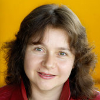

Egovision Team
==============

**Alejandro Betancourt** [Founder and Development Lead]
Ph.D candidate of the Interactive and Cognitive Environment program between the Universita degli Studi di Genova and the Eindhoven University of Technology.   He is a Mathematical Engineer and Master In Applied Mathematics from EAFIT University (Medellin, Colombia). Since 2011 has been involved in research about Artificial Intelligence, Machine Learning and Cognitive Systems. The first codes of this library are based on his PhD thesis about the role of the hands in First Person Vision.
 

**Pietro Morerio** [Contributor]
Received his B.SC in Physics from the Faculty of Science, University of Milan (Italy) in 2007. In 2010 he received from the same university his M. Sc. in Theoretical Physics (summa cum laude). He was Research Fellow at the University of Genoa (Italy) from 2011 to 2012, working in Video Analysis for Interactive Cognitive Environments. Currently, he is pursuing a PhD degree in Computational Intelligence at the same institution.

**Lucio Marcenaro** [Technical Contributor]
Enjoys over 15 years experience in image and video sequence analysis, and authored about 100 technical papers related to signal and video processing for computer vision. An Electronic Engineering graduate from Genova University in 1999, he received his PhD in Computer Science and Electronic Engineering from the same University in 2003. From 2003 to 2010 he was CEO and development manager at TechnoAware srl. From March 2011, he became Assistant Professor in Telecommunications for the Faculty of Engineering at the Department of Electrical, Electronic, Telecommunications Engineering and Naval Architecture (DITEN) at the University of Genova where he teaches the courses of Pervasive Electronics and Computer Programming and Telematics Lab.

**Emilia Barakova** [Technical Contributor]
Emilia I. Barakova received the Master’s degree in electronics and automation from the Technical University of Sofia, Sofia, Bulgaria, and the Ph.D. degree in mathematics and physics from Groningen University, The Netherlands, in 1999. She has a background in Artificial intelligence (Groningen University), Behavioral robotics (GMD-Japan research laboratory), Brain-inspired robotics (RIKEN Brain Science Institute, Japan), and Social signal processing,  social robotics and user-centered interaction design (Eindhoven University of Technology). She  is  currently  with  the  Department  of  Industrial  Design,  Eindhoven  University  of  Technology, Eindhoven,  The  Netherlands.   Her recent research is on modeling human behavior, cognition and social interactions. Barakova is an Editor of Personal and Ubiquitous computing journal and Journal of Integrative Neuroscience. 

**Carlo Regazzoni** [Technical Contributor]
Carlo S. Regazzoni received the Laurea degree in Electronic Engineering and the Ph.D. in Telecommunications and Signal Processing from the University of Genoa (UniGE), in 1987 and 1992, respectively. Since 2005 Carlo is Full Professor of Telecommunications Systems. Dr. Regazzoni is involved in research on Signal and Video processing and Data Fusion in Cognitive Telecommunication Systems since 1988.

